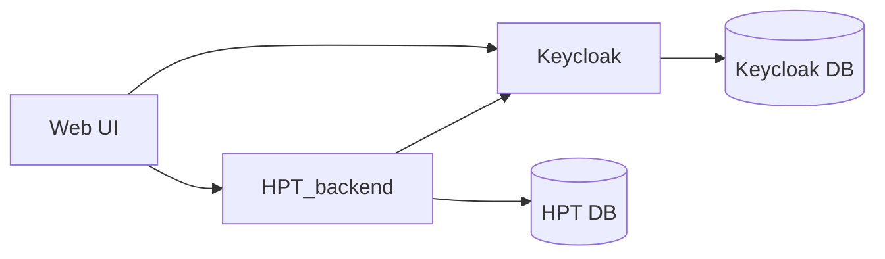

# testcontainers-workshop

    
    

    

## "De VakantiePlanner"

Tijdens de workshop werken we aan het testen van een VakantiePlanner.
Met deze VakantiePlanner kunnen collega's onderling hun vakantie afstemmen.
Want we verdienen allemaal weleens een dagje vrij, toch?

## High level architectuur
De architectuur ziet er in grote lijnen zo uit:

De authenticatie werkt via Keycloak. Keycloak is een veelgebruikte authenticatie-oplossing.

De VakantiePlanner zelf gebruikt ook een Postgres database, maar deze instantie staat helemaal
los van de database van Keycloak.
s
De UI communiceert alleen met de VakantiePlanner-backend en met Keuycloak voor het inloggen.